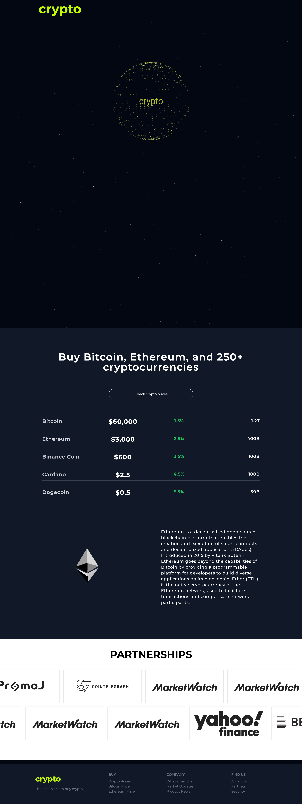

# 3D Crypto - Documentation
Welcome to 3D Crypto documentatiob.

## Live Demo - [3D-Crypto](https://3d-crypto.vercel.app/)

## Introduction
React:

React is a JavaScript library for building user interfaces. It helps manage the dynamic aspects of a web application, allowing us to create reusable components and efficiently update the user interface in response to user interactions.

Three:

Three.js is a JavaScript library that simplifies the creation of 3D graphics in the browser. It provides a set of tools and abstractions for working with WebGL, making it easier to render complex 3D scenes on the web.

React Three Fiber:

React Three Fiber is a React renderer for Three.js. It facilitates the integration of Three.js into a React application by providing a declarative way to work with 3D elements as React components. This simplifies the process of creating and managing 3D scenes within a React-based project.

React Three Drei:

React Three Drei is a collection of useful abstractions and components built on top of React Three Fiber. It offers additional functionalities and pre-built components, streamlining the development of complex 3D scenes in React applications.

React Fast Marquee:

React Fast Marquee is a React component that enables the creation of fast and efficient marquees or scrolling text effects. It's designed to handle smooth scrolling animations.

Tailwind CSS:

Tailwind CSS is a utility-first CSS framework that streamlines the styling process. It provides a set of pre-defined utility classes that can be directly applied to HTML elements.

## Installation

`Clone repo`

  - `npm i` `npm run dev`

## Technology Stack

- React
- Three 
- React Three Fiber
- React Three Drei
- React Fast Marquee
- Math
- Tailwind CSS

## Video example

